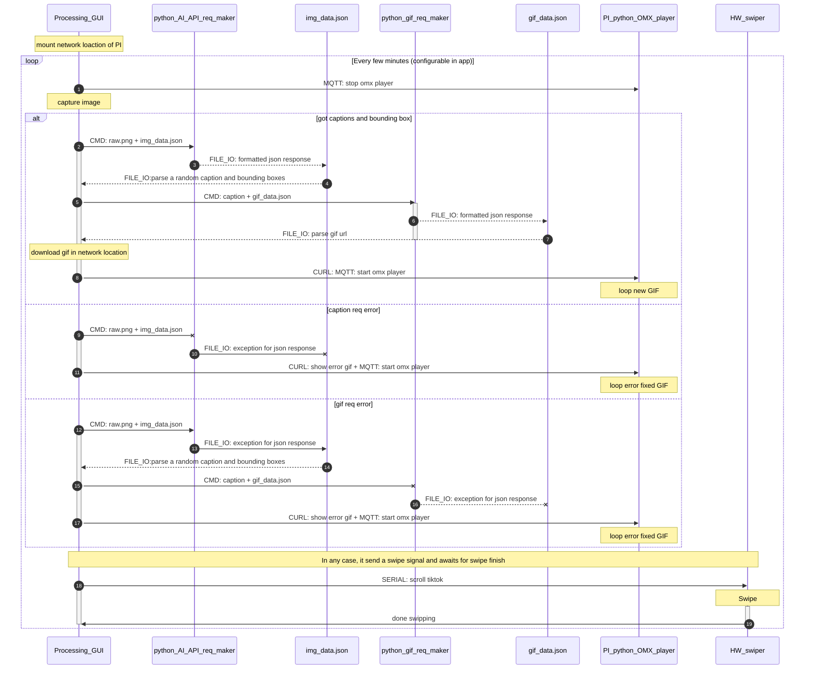

# memtic_self

* [PROJECT PAGE](https://www.dattasaurabh.com/mi-e-metic-self)
* [INSTALLATION GUIDE](https://dattabaumstudio.notion.site/Mimetic-self-Installation-and-Maintenance-Guide-89d1f03d15b848089516b9a0ae4b9f4f?pvs=4)

## System Architecture overview:

