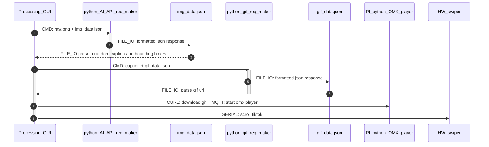

# memtic_self

<https://www.dattasaurabh.com/mi-e-metic-self>

```mermaid
sequenceDiagram
    autonumber

    participant Processing_GUI
    participant python_AI_API_req_maker
    participant img_data.json
    participant python_gif_req_maker
    participant gif_data.json
    participant PI_python_OMX_player
    participant HW_swiper

    
    Processing_GUI->>python_AI_API_req_maker: CMD: raw.png + img_data.json
    activate python_AI_API_req_maker
    python_AI_API_req_maker-->>img_data.json: FILE_IO: formatted json response
    img_data.json-->>Processing_GUI: FILE_IO:parse a random caption and bounding boxes
    deactivate python_AI_API_req_maker
    
    
    Processing_GUI->>python_gif_req_maker: CMD: caption + gif_data.json
    activate Processing_GUI
    activate python_gif_req_maker
    python_gif_req_maker-->>gif_data.json: FILE_IO: formatted json response
    gif_data.json-->>Processing_GUI: FILE_IO: parse gif url
    deactivate python_gif_req_maker
    Processing_GUI->>PI_python_OMX_player: CURL: download gif + MQTT: start omx player 
    Processing_GUI->>HW_swiper: SERIAL: scroll tiktok
    deactivate Processing_GUI
```
